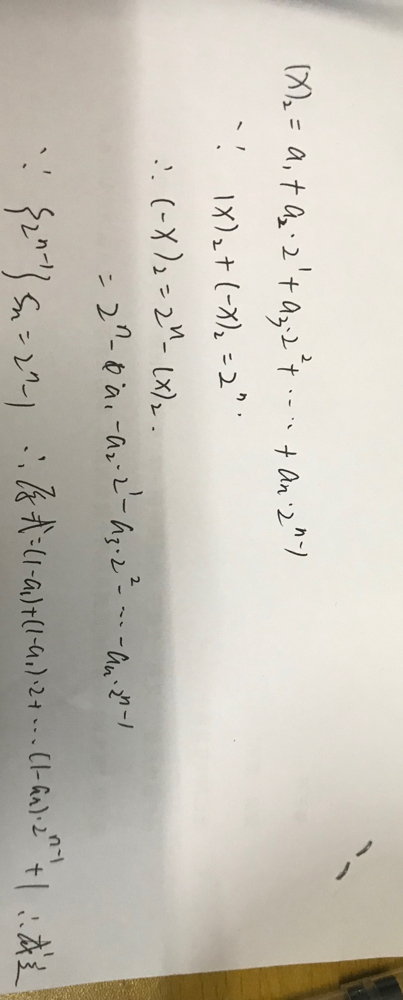

# Part 1 of 2
1) int8_t x = 67;  int8_t y = -7;   int8_t z = y - x;

   x= 01000011 ; y= 11111001 ; z= 10110110 (溢出错误)

2) int8_t x = 0xd3; 

   x= 11010011 (溢出错误)

3) uint8_t = 0xd3; 

   x= 11010011

4) int8_t x = 127;  int8_t y = -7;   int8_t z = y – x;

   x= 01111111 ; y= 11111001 ; z= 101111001 (溢出错误)

5) float x = 1.125; 

   x= 1.001000

6) float x = 23.0;

   x= 10111.000000

7) float x = 0.45;
 
   x= 0.011100 (精度误差)

# Part 2 of 2

Method of complements： In mathematics and computing, the method of complements is a technique used to subtract one number from another using only addition of positive numbers.

在数学和计算中，补足法是一种仅用正数的加法从一个数字中减去另一个数字的技术。

Byte: The byte is a unit of digital information that most commonly consists of eight bits, representing a binary number.

字节是数字信息的单位，通常由8位组成，代表一个二进制数。

Integer (computer science): In computer science, an integer is a datum of integral data type, a data type that represents some range of mathematical integers.

在计算机科学中，整数是整数数据类型的基准，数据类型表示一些数学整数的范围。

Floating point：In computing, floating-point arithmetic (FP) is arithmetic using formulaic representation of real numbers as an approximation so as to support a trade-off between range and precision. 

在计算中，浮点运算(FP)是利用实数的公式化表示作为近似，以支持范围和精度之间的权衡的一种算法。

1

2

361

1
x=0xe1

y=0xffffffe1

NaN:In computing, NaN, standing for not a number, is a numeric data type value representing an undefined or unrepresentable value, especially in floating-point calculations. 

在计算中，代表非数字的NaN是一个数字数据类型值，表示未定义或不可表示的值，特别是在浮点计算中。
