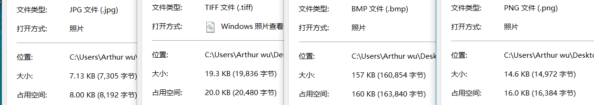

ASCII: ASCII abbreviated from American Standard Code for Information Interchange, is a character encoding standard for electronic communication. 

ASCII是美国信息交换标准码的缩写，是一种用于电子通信的字符编码标准。

Color: Color (American English) or colour (Commonwealth English) is the characteristic of human visual perception described through color categories, with names such as red, orange, yellow, green, blue, or purple.

颜色(美式英语)或颜色(英联邦英语)是通过颜色分类描述的人类视觉感知的特征，这些分类有红色、橙色、黄色、绿色、蓝色或紫色。

A: 65 0391 CE91

中: 无 \u4e2d &#x4E2D

yellow: R 255 G 255 B 0

从网上下载一个 BMP 格式图像,用图片编辑工具另存在 jpg、 png、tiff 格式。问三种格式中,哪种格式显示质量好?相对于 BMP 格式,压缩率各是多少? 

tiff的质量好
压缩率： jpg：4.55% png: 9.31% tiff: 12.33%

 Winrar压缩文件是lossless, or lossy 方法？

lossless.

