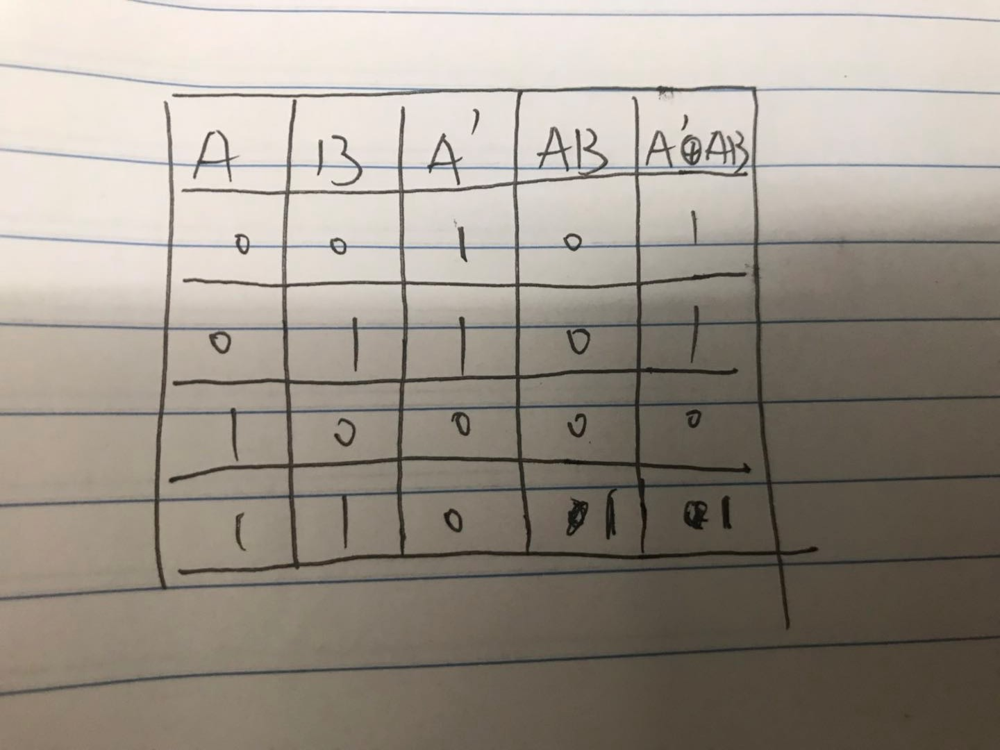

# part 1  of  2

1、Give the three representations of an AND gate and say in your words what AND means. 

布尔表达：x=AB

逻辑图：如下图

真值表：如下图

逻辑与指AB同为1结果为1，否则为0

2、Give the three representations of an XOR gate and say in your words what XOR means. 

布尔表达：x=A ⊕ B

逻辑图：如下图

真值表：如下图

逻辑与指AB不同为1，相同为0

3、Draw a circuit diagram corresponding to the following Boolean expression: (A + B)(B + C) 

如下图

4、Show the behavior of the following circuit with a truth table

如下图

5、What is circuit equivalence? Use truth table to prove the following formula. 

等效电路指一样的输入的情况下输出相同的电路即为等效电路

证明如下图

# part 2  of  2

6、There are eight 1bit full adder integrated circuits. Combine them to 8bit adder circuit using the following box diagram.

如下图

(X8X7X6X5X4X3X2X1)2 or (00001111)2 = 
(X8X7X6X5X4+1X3+1X2+1X1+1)2   

(X8X7X6X5X4X3X2X1)2 xor (00001111)2 = (X8⊕0X7⊕0X6⊕0X5⊕0X4⊕1X3⊕1X2⊕1X1⊕1)2 

((X8X7X6X5X4X3X2X1)2 and(11110000)2 ) or  
(not (X8X7X6X5X4X3X2X1)2 and (00001111)2)  =  (X8X7X6X5X4X3X2X1)2

# part 3  of  3

使用维基百科，解释以下概念。 

1、Logic gate 

In electronics, a logic gate is an idealized or physical device implementing a Boolean function; that is, it performs a logical operation on one or more binary inputs and produces a single binary output. 

在电子学中，逻辑门是实现布尔函数的理想或物理设备;也就是说，它对一个或多个二进制输入执行逻辑操作，并生成单个二进制输出。

2、Boolean algebra

In mathematics and mathematical logic, Boolean algebra is the branch of algebra in which the values of the variables are the truth values true and false, usually denoted 1 and 0 respectively. 

在数学和数学逻辑中，布尔代数是代数的一个分支，其中变量的值为真值和假值，通常分别表示为1和0。

自学存储电路。维基百科：“Flip-flop”，选择中文： 

1、Flip-flop 中文翻译是？ 

触发器

2、How many bits information does a SR latch store?
1 bit.

 
