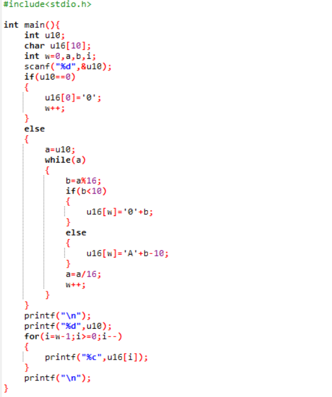

# 作业 

1、阅读 PseudocodeStandard。（答案可以打印） 

1）用伪代码描述将十进制转换成16进制的方法 

2）C语言实现（先用注释写好算法，然后翻译）

3）使用 -1,  0,  1,  15,   26，3265 最为输入测试你的程序

1） 

READ a number n;

IF the number n is 0 THEN

    the first number of the hexadecimal of n is 0;

    INCREMENT counter;

ELSE

    make a equal to n;

    WHILE (a>0)

        make b equal to the remainder of a mod 16;

        IF (the remainder less than 10) THEN

            the number of the hexadecimal equal to the number from 0 to 9

        ELSE

            the number of the hexadecimal equal to the number from 'a' to 'e'

        END IF

        make a equal to itself minus 16;

        INCREMENT counter;
    
    END WHILE

END IF

print the answer;

2）

2、名词解释与对比 

1）Top-down design 

2） Work breakdown structure (WBS) 

3）简述管理学WBS 与 信息学Top-down设计 的异同

1、Top-down is strategies of information processing and knowledge ordering, used in a variety of fields including software, humanistic and scientific theories (see systemics), and management and organization. 

自顶向下是信息处理和知识排序的策略，应用于各种领域，包括软件、人本和科学理论(参见系统学)、管理和组织。

2、A work-breakdown structure (WBS) in project management and systems engineering, is a deliverable-oriented breakdown of a project into smaller components. A work breakdown structure is a key project deliverable that organizes the team's work into manageable sections. 

在项目管理和系统工程中，工作分解结构(WBS)是将项目分解为更小的组件的面向交付的分解。工作分解结构是一个关键的可交付项目，它将团队的工作组织成可管理的部分。

3、同：都是分解系统以了解子系统；异：WBS以类型分， Top-down自上而下。

3、仔细观察您洗衣机的运作过程，运用Top-down设计方法和Pseudocode 描述洗衣机控制程序。假设洗衣机可执行的基本操作如下： 

water_in_switch(open_close)  // open 打开上水开关，close关闭 

water_out_switch(open_close)  // open 打开排水开关，close关闭 

get_water_volume()  //返回洗衣机内部水的高度

motor_run(direction) // 电机转动。left左转，right右转，stop停 

time_counter()  // 返回当前时间计数，以秒为单位 

halt(returncode) //停机，success 成功 failure 失败

1）请使用伪代码分解“正常洗衣”程序的大步骤。包括注水、浸泡等 

2）进一步用基本操作、控制语句（IF、FOR、WHILE等）、变量与表达式，写出每 个步骤的伪代码 

3）根据你的实践，请分析“正常洗衣”与“快速洗衣”在用户目标和程序上的异同。 你认为是否存在改进（创新）空间，简单说明你的改进意见？ 

4）通过步骤3），提取一些共性功能模块（函数），简化“正常洗衣”程序，使程序 变得更利于人类理解和修改维护。例如： wait(time) //等待指定的时间； 注水(volume,timeout) //在指定时间内完成注水，否则停机； 排水(timeout)。等子程序

1、

打开电源

选择 洗衣模式

输入 时间和水位

预设 浸泡时间

    打开注水开关

预设 漂洗时间

    电机转动次数，左转右转

打开排水开关

脱水

    提高电机转动速度

    设定周期

关闭电源

2、

READ the model that the user choose, the time of rinse ,soak and dehydration , the volumn of the water

REPEAT

    switch on the switch of the water-in

    INCREMENT the water volumn counter

UNTIL the water volumn counter is equal to the volumn of the water

WHILE (the soak counter < the time of soaking)

    soak;

    INCREMENT the soak counter;

END WHILE

WHILE (the time of rinse > 0)

    run the motor

    INRREMENT the left direction

    INCREMENT the right direction

    decrease the time of rinse

END WHILE

WHILE (the water line is not equal to 0)

    turn on the switch of the water-out

    decrease the water line

END WHILE

REPEAT 

    run the moter according to the cycle

    speed up the velocity of the moter

    decrease the time of dehydration

UNTIL (the time of dehydration is equal to 0)

3、快速洗衣比正常洗衣少了浸泡的过程，但可以提到电机转速和降低其周期以保证快速洗衣的洁净程度，也可以提高用电效率，增加储水功能，快速进水。

4、

function water-in(the volumn of the water user need)

REPEAT

    switch on the switch of the water-in

    INCREMENT the water volumn counter

UNTIL the water volumn counter is equal to the volumn of the water

function rinse(the time of rinse,left,right)

WHILE (the time of rinse > 0)

    run the motor

    INRREMENT the left direction

    INCREMENT the right direction

    decrease the time of rinse

END WHILE

function water-out(water line)

WHILE (the water line is not equal to 0)

    turn on the switch of the water-out

    decrease the water line

END WHILE

function dehydration(velocity,cycle,the time of dehydration)

REPEAT 

    run the moter according to the cycle

    speed up the velocity of the moter

    decrease the time of dehydration

UNTIL (the time of dehydration is equal to 0)

