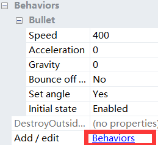

# 使用construct 2 制作游戏——钢铁侠大战灭霸

## 素材

在制作游戏之前，先要采集好素材，例如玩家、子弹等等。
以下为本游戏所要的素材，包括玩家，玩家子弹、敌人、敌人子弹、背景。

## 制作

### 新建

打开construct 2， 并新建一个项目（快捷键CTRL+N）。

### 修改游戏背景尺寸
在左栏 Properties 中点击 View ，打开新界面，随后在 Window Size 将尺寸修改为 800，800。

### 添加对象

在右下方 objects 区域右键,点击Insert new object ，然后找到 Sprite ，修改名称，然后点击插入，然后鼠标指针变为一个”加号”，点击屏幕中央任意位置，即会打开一个窗口，然后点击左上角添加图片，选择你要添加的素材。最后调整大小。

### 添加背景

在右下方 objects 区域右键,点击 Insert new object ，然后找到Tiled Background，修改名称，然后点击插入，然后鼠标指针变为一个”加号”，点击屏幕中央任意位置，即会打开一个窗口，然后点击左上角添加图片，选择一张作为背景图，其后关闭窗口即可。添加完成后可以自己对背景图大小进行修改以让其与窗口大小相吻合。

### 编写任务

#### 鼠标

首先要添加鼠标对象，同样是在Object的区域点击鼠标右键，找到Insert New object，然后找到Mouse，添加即可。 
然后点击上方Event sheet，再点击Add event，选System，然后选Every tick，再来点击Add action，选player，找到Set position，X和Y分别对应选择鼠标的X和Y坐标，通过双击选中上方的鼠标图案并在里面寻找实现，然后点击Done完成。

#### 钢铁侠与子弹

点击上方Event sheet，再点击Add event，选System，然后选Every X second，修改为每0.2s触发一次，再来点击Add action，选择钢铁侠，找到Spawn another object，然后新对象选钢铁侠子弹，Layer填1，另一个默认，再来点击Add action，选择钢铁侠，找到Set angle，选择-90 30 150三个角度，完成。

为了使子弹正常发射，需要做以下操作，选择钢铁侠子弹，点击左栏Behaviors，点击左上角的加号，添加命令Bullet 和 Destroy Outside Layout。

#### 灭霸与子弹

首先灭霸与子弹的命令与钢铁侠与子弹的命令相同，重新选择一遍即可。
其中区别在于，我们要使灭霸的子弹总是射向钢铁侠，要修改命令。点击Add action，选择灭霸的子弹，找到Set angle toward position，然后在上栏选择钢铁侠的坐标，完成。

再来设定灭霸随机出现在地图的任意位置。
Event sheet -> System -> Every X time -> 1.0s 
-> Add action -> System -> Create object 
然后对象选灭霸，Layer填1，X坐标随机，Y坐标随机，完成

#### 碰撞
让子弹碰撞的时候同时消失，让灭霸子弹与钢铁侠碰撞时钢铁侠消失，让钢铁侠子弹与灭霸碰撞时灭霸消失。 
    Add event -> 钢铁侠 -> On collision with another object 
   -> 灭霸子弹 -> Add action -> 钢铁侠 -> Destroy
   其他两种情况命令相同，对象不同。

## 游戏效果

