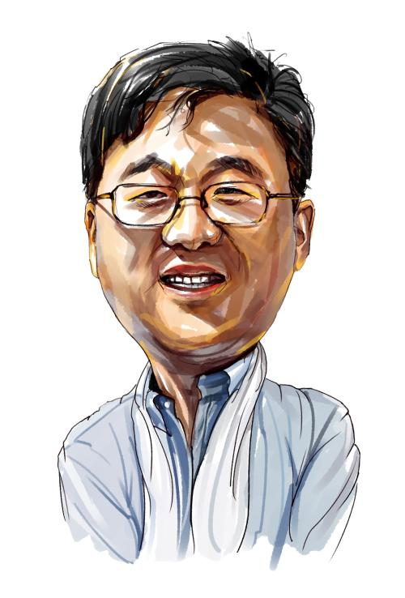

# 网易大佬——丁三石

## 有趣的简历

1971年10月生于宁波 

1993年毕业于成都电子科技大学 

1993~1995年在宁波市电信局工作 

1995~1996年在Sebyse广州分公司工作 

1997年5月至今创办网易 靠网络起家的丁磊在“2006胡润IT富豪榜”中以90亿元成为国内IT首富，又与段永平联手向浙江大学捐赠4000万美元，支持教育事业。

网易公司首席架构设计师,丁磊1997年6月创立网易公司，将网易从一个10几个人的私企发展到今天拥有近300员工在美国公开上市的知名互联网技术企业。

2000年3月，丁磊辞去首席执行官，出任网易公司联合首席技术执行官，2001年3月，担任首席架构设计师，专注于公司远景战略的设计与规划。

## 学生时代

丁磊出生在一个高级知识分子家庭，他四五岁的时候，也很淘气，但不是像别的孩子一
样整天在外面调皮捣蛋，而是喜欢呆在家里摆弄他的小玩意：一些电子管件、半导体之类
的东西——丁磊的父亲是宁波一个科研机构的工程师，后来丁磊迷上无线电，很大程度上是
受了父亲的影响。初一的时候，他组装了自己的第一台六管收音机，在当时，那是一种最
复杂的收音机，能接受中波、短波和调频广播，这项发明，在当地一时传为佳话，都说丁
家出了个“神童”，长大以后一定是当科学家的料子。

## 大学时代

 1989年进入电子科技大学的丁磊，对成都的潮湿天气十分不适应，但这丝毫没有影响到他乐观的性格。丁磊大学时代的辅导员张陈兴老师讲，丁磊总是一幅笑嘻嘻的面孔，他还是班里的团支部书记，乐于助人。如果说丁磊能有后来的成就，应该归功于他经常到图书馆翻阅外文科技尤其是计算机书籍，“他比别人早一步得到最新的世界科技动态，有关互联网的信息也是从那里得来的。”

丁磊不愿谈及其个人生活。但成名之后，他在公开场合曾表示，他不反对大学生谈恋爱，只是不要荒废学业。他使用荒废而不是影响，可见他对谈恋爱所消耗的时间和精力是有足够认识的。

然而，在大学真正占用其大量时间的还是当时方兴未艾的计算机技术和知识。他大学的冯老师说：“让我印象最深刻的是，1992年冬天，丁磊大四上学期，我搞了一个电磁场CI软件的成果展示。丁磊和其他几个同学下来主动找到我说，他们对此十分感兴趣，如果交给他们做，一定能把这个软件做得更好。那自信的模样让我感动。”

在课题组工作的日子，丁磊已经展示出了较强的能力，尤其是在计算机编程方面。“在当时能用计算机编程和做一些界面的设计，已经是很不错的事情。”

丁磊对计算机编程的兴趣从这里展开，他的性格也在大学时代逐渐显现出来。冯老师说，“丁磊给我的感觉就是他不是个被人安排的人。”这样的性格被他大学时代的室友伍浩进一步演绎，他说：“他的成绩只是中上，他不张扬，但他的闯劲给人印象深刻，他的爱好就是编程。”

## 跳槽经历

在Internet上“见了世面”的丁磊向自己的总工建议在本局开展信息服务业务，等了一段时间，发现没有什么进展，便决定离开。

1995年5月，丁磊来到广州，加盟刚刚成立的广州Sybase。在Sybase一年，丁磊感觉自己除了整天安装调试数据库外，几乎没有什么进步，于是又选择了离开。

1996年5月，丁磊当上了广州一家ISP的总经理技术助理。在这家ISP，他架设了Chinanet上第一个“火鸟”BBS，结识了很多网友。
好景难长，丁磊所在的ISP由于面临激烈竞争和昂贵的电信收费几乎无法生存下去。1997年5月，他只得再一次选择了离开。

已经三次跳槽的丁磊在1997年的那个5月对自己的前途整整思考了5天，最后的决定是自立门户，干一番事业。“我根本不知道自己的公司未来该靠什么赚钱，只天真地以为只要写一些软件，做一些系统集成就可以了。这种想法后来几乎使公司无法生存。”

网易创业的50万元资金一部分是丁磊几年来一行一行写程序积攒下来的，另一部分是向朋友借的。

## 创业之路

BBS、个人主页很热闹，可办公司图的是赚钱。比照Yahoo！开发的中文搜索引擎，Yeah引擎没有成功，下一步做什么？丁磊他们不得不仔细考虑这个问题。

整天冥思苦想的丁磊在发现Hotmail的时候，眼睛豁地亮了起来。网易准备借10万美元买一套Hotmail系统，在中国建免费邮箱站点。Hotmail先说不卖，后来答复280万美元一套，另外加收每小时2000美元的安装费。
丁磊找来自己的伙伴陈磊华研究Hotmail的结构，两个人最后决定自己做。一个月下来，他们俩的知识大增。几个伙伴经常为一个技术上的突破兴奋得手舞足蹈。

一边开发免费电子邮箱，一边想域名。丁磊认定免费电子邮箱要想成功一定得有一个朗朗上口的域名才行。怎样的域名才好记？丁磊几乎天天都在想这个问题。

凌晨2点，丁磊突然想到可以用数字表示域名，中国数字的发音特别干脆，而且163、169在中国已经具有了指向Chinanet和电信局以及Internet的含义，上网的人每天都要拨163，对它熟悉得不能再熟悉了。
想到这，丁磊从床上跳了起来，拨163上网，查询了一下163.net和163.com这两个域名，谢天谢地，还没有被注册。注册下这两个域名，丁磊又去睡觉，却怎么睡也睡不着了，他越想越美，就又从床上跳起来一口气注册了188.net、188.com、166.net、166.com、126.net、126.com等一大串域名。

7个月后，功能强大的网易免费邮箱系统写好了，163的域名也有了，万事俱备，但当丁磊向电信局申请增加免费邮箱服务的时候，却碰到了困难。广州电信不容许网易独立经营免费邮箱业务。　

丁磊非常着急，他拿着免费邮箱的可行性分析四处寻求合作，结果遇到最多的质疑就是“这个项目什么时候可以赚钱?”丁磊老实地告诉人家：“我不知道什么时候可以赚钱，但我知道这个项目很有前途。”这样的回答不能让人满意，不能立即赚钱的项目没有多少人关心。

全国各地跑了一圈没有结果，丁磊不得不折回头再和广州电信局谈合作。此时已经心急火燎的丁磊抛出了“合作经营，不让电信局出一分钱，软硬件全由网易投入，而利润6∶4分成的方案（电信得6）”。这个方案提醒了电信局。广州电信提出要购买网易的免费邮箱，可丁磊的答复是：“不卖”。
又花了两个月的时间，丁磊依然没有找到合作伙伴。网易创业的50万元已经撑了好几个月，公司再不挣钱，日子将难以为继。此时的丁磊根本不知道什么是风险资金。而且，“我也不愿意负债经营，因为Internet风险很大，是否能成功，我也不敢肯定。”

就在丁磊四处碰壁的时候，Hotmail被微软3.5亿美元收购。1998年2月，丁磊最终答应将中文免费邮箱系统出售给广州电信。广州电信提出要同时附送163域名，丁磊想了想，“这一送，我也知道里面的价值含量有多少。广州电信建163.net，连硬件投资只用了100多万元，其中的硬件和数据库系统占整个投入的75％，我们税后利润很少，但网易的发展需要资金注入，不得不为之。”每次看到这个主页，不知丁磊心里是啥滋味。
1998年2月16日，www.163.net开放使用，反应强烈，注册用户数以每天2000人左右的速度递增，至今用户已经达到35万。163.net成功后，很多公司纷纷打电话到网易要求购买该系统，这和一开始丁磊四处寻求合作伙伴却没人理睬的局面形成了鲜明的对比。

1997年5月，丁磊创办网易公司，他占有50%以上的股份，成为真正的老板。

## 成功
2000年6月，网易在纳斯达克正式挂牌上市。
2009年，宣布网易养猪计划。
2015年2月11日，入选“2014中国互联网年度人物”。  
2015年10月26日，以75亿美元的财富位列《2015年福布斯中国富豪榜》第十。 
2016年2月24日，丁磊 财富630亿元新进《2016胡润全球富豪榜》大陆前十名，位列第十，全球第121位，比2015年上升30位。
10月13日，2016年胡润百富榜发布，丁磊以1000亿元财富，位列第六名。  
10月18日，《2016胡润IT富豪榜》发布，丁磊以960亿元排名第三。
10月27日，2016福布斯中国富豪榜公布，丁磊以152亿美元财富，排名第五位。 
大家都在使用网易邮箱，大家都在使用网易云音乐。

