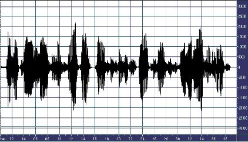
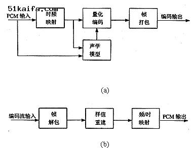
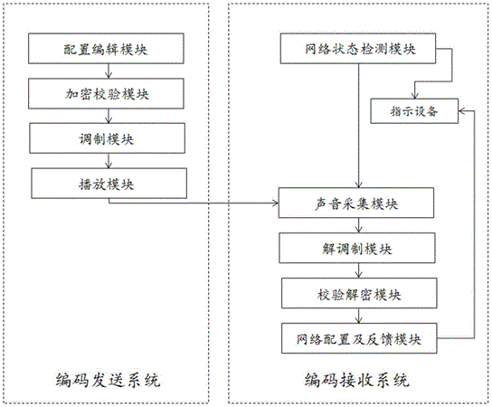
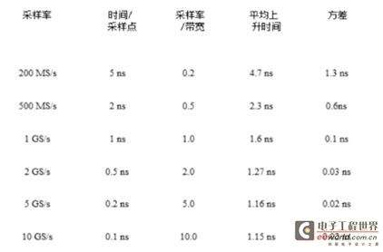
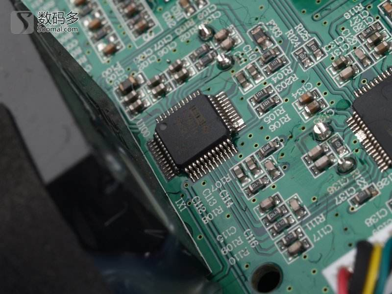

# 音频编码

自然界中的声音非常复杂，波形极其复杂，通常我们采用的是脉冲代码调制编码，即PCM编码。PCM通过抽样、量化、编码三个步骤将连续变化的模拟信号转换为数字编码。

## 采样率和采样大小

声音其实是一种能量波，因此也有频率和振幅的特征，频率对应于时间轴线，振幅对应于电平轴线。波是无限光滑的，弦线可以看成由无数点组成，由于存储空间是相对有限的，数字编码过程中，必须对弦线的点进行采样。采样的过程就是抽取某点的频率值，很显然，在一秒中内抽取的点越多，获取得频率信息更丰富，为了复原波形，一次振动中，必须有2个点的采样，人耳能够感觉到的最高频率为20kHz，因此要满足人耳的听觉要求，则需要至少每秒进行40k次采样，用40kHz表达，这个40kHz就是采样率。我们常见的CD，采样率为44.1kHz。光有频率信息是不够的，我们还必须获得该频率的能量值并量化，用于表示信号强度。量化电平数为2的整数次幂，我们常见的CD位16bit的采样大小，即2的16次方。采样大小相对采样率更难理解，因为要显得抽象点，举个简单例子：假设对一个波进行8次采样，采样点分别对应的能量值分别为A1-A8，但我们只使用2bit的采样大小，结果我们只能保留A1-A8中4个点的值而舍弃另外4个。如果我们进行3bit的采样大小，则刚好记录下8个点的所有信息。采样率和采样大小的值越大，记录的波形更接近原始信号。

## 有损无损

根据采样率和采样大小可以得知，相对自然界的信号，音频编码最多只能做到无限接近，至少目前的技术只能这样了，相对自然界的信号，任何数字音频编码方案都是有损的，因为无法完全还原。在计算机应用中，能够达到最高保真水平的就是PCM编码，被广泛用于素材保存及音乐欣赏，CD、DVD以及我们常见的WAV文件中均有应用。因此，PCM约定俗成了无损编码，因为PCM代表了数字音频中最佳的保真水准，并不意味着PCM就能够确保信号绝对保真，PCM也只能做到最大程度的无限接近。我们而习惯性的把MP3列入有损音频编码范畴，是相对PCM编码的。强调编码的相对性的有损和无损，是为了告诉大家，要做到真正的无损是困难的，就像用数字去表达圆周率，不管精度多高，也只是无限接近，而不是真正等于圆周率的值。

## 频率与采样率的关系

采样率表示了每秒对原始信号采样的次数，我们常见到的音频文件采样率多为44.1KHz，这意味着什么呢？假设我们有2段正弦波信号，分别为20Hz和20KHz，长度均为一秒钟，以对应我们能听到的最低频和最高频，分别对这两段信号进行40KHz的采样，我们可以得到一个什么样的结果呢？结果是：20Hz的信号每次振动被采样了40K/20=2000次，而20K的信号每次振动只有2次采样。显然，在相同的采样率下，记录低频的信息远比高频的详细。这也是为什么有些音响发烧友指责CD有数码声不够真实的原因，CD的44.1KHz采样也无法保证高频信号被较好记录。要较好的记录高频信号，看来需要更高的采样率，于是有些朋友在捕捉CD音轨的时候使用48KHz的采样率，这是不可取的！这其实对音质没有任何好处，对抓轨软件来说，保持和CD提供的44.1KHz一样的采样率才是最佳音质的保证之一，而不是去提高它。较高的采样率只有相对模拟信号的时候才有用，如果被采样的信号是数字的，请不要去尝试提高采样率。

#几种编码格式的区别

PCM编码(原始数字音频信号流) 

类型：Audio 

制定者：ITU-T 

所需频宽：1411.2 Kbps 

特性：音源信息完整，但冗余度过大 

优点：音源信息保存完整,音质好 

缺点：信息量大，体积大，冗余度过大 

应用领域：voip 

版税方式：Free 

备注：在计算机应用中，能够达到最高保真水平的就是PCM编码，被广泛用于素材保存及音乐欣赏，CD、DVD以及我们常见的WAV文件中均有应用。因此，PCM约定俗成了无损编码，因为PCM代表了数字音频中最佳的保真水准，并不意味着PCM就能够确保信号绝对保真，PCM也只能做到最大程度的无限接近。要算一个PCM音频流的码率是一件很轻松的事情，采样率值×采样大小值×声道数bps。一个采样率为44.1KHz，采样大小为16bit，双声道的PCM编码的WAV文件，它的数据速率则为 44.1K×16×2 =1411.2Kbps。我们常见的Audio CD就采用了PCM编码，一张光盘的容量只能容纳72分钟的音乐信息。

WMA(Windows Media Audio) 

类型：Audio 

制定者：微软公司 

所需频宽：320～112kbps（压缩10～12倍） 

特性：当Bitrate小于128K时，WMA几乎在同级别的所有有损编码格式中表
现得最出色，但似乎128k是WMA一个槛，当Bitrate再往上提升时，不会有太多的音质改变。 

优点：当Bitrate小于128K时，WMA最为出色且编码后得到的音频文件很小。 

缺点：当Bitrate大于128K时，WMA音质损失过大。WMA标准不开放，由微软掌握。 

应用领域：voip 

版税方式：按个收取 

备注：WMA的全称是Windows Media Audio，它是微软公司推出的与MP3格式齐名的一种新的音频格式。由于WMA在压缩比和音质方面都超过了MP3，更是远胜于RA(Real Audio)，即使在较低的采样频率下也能产生较好的音质，再加上WMA有微软的Windows Media Player做其强大的后盾，所以一经推出就赢得一片喝彩。

LPC(Linear Predictive Coding，线性预测编码) 

类型：Audio 

 
所需频宽：2Kbps-4.8Kbps 

特性：压缩比大，计算量大，音质不高，廉价 

优点：压缩比大,廉价 

缺点：计算量大，语音质量不是很好，自然度较低 

应用领域：voip 

版税方式：Free 

备注：参数编码又称为声源编码，是将信源信号在频率域或其它正交变换域提取特征参数，并将其变换成数字代码进行传输。译码为其反过程，将收到的数字序列经变换恢复特征参量，再根据特征参量重建语音信号。具体说，参数编码是通过对语音信号特征参数的提取和编码，力图使重建语音信号具有尽可能高的准确性，但重建信号的波形同原语音信号的波形可能会有相当大的差别。如：线性预测编码（LPC）及其它各种改进型都属于参数编码。该编码比特率可压缩到2Kbit/s-4.8Kbit/s，甚至更低，但语音质量只能达到中等，特别是自然度较低。

MPEG-1 audio layer 1 

类型：Audio 

制定者：MPEG 

所需频宽：384kbps（压缩4倍） 

特性：编码简单，用于数字盒式录音磁带，2声道，VCD中使用的音频压缩方案就是MPEG-1层Ⅰ。 

优点：压缩方式相对时域压缩技术而言要复杂得多，同时编码效率、声音质量也大幅提高，编码延时相应增加。可以达到“完全透明”的声音质量（EBU音质标准） 

缺点：频宽要求较高 

应用领域：voip 

版税方式：Free 

备注：MPEG-1声音压缩编码是国际上第一个高保真声音数据压缩的国际标准，它分为三个层次： 
–层1(Layer 1)：编码简单，用于数字盒式录音磁带 
–层2(Layer 2)：算法复杂度中等，用于数字音频广播(DAB)和VCD等 
–层3(Layer 3)：编码复杂，用于互联网上的高质量声音的传输，如MP3音乐压缩10倍

MP3(MPEG-1 audio layer 3) 

类型：Audio 

制定者：MPEG 

所需频宽：128～112kbps（压缩10～12倍） 

特性：编码复杂，用于互联网上的高质量声音的传输，如MP3音乐压缩10倍，2声道。MP3是在综合MUSICAM和ASPEC的优点的基础上提出的混合压缩技术，在当时的技术条件下，MP3的复杂度显得相对较高，编码不利于实时，但由于MP3在低码率条件下高水准的声音质量，使得它成为软解压及网络广播的宠儿。 

优点：压缩比高，适合用于互联网上的传播 

缺点：MP3在128KBitrate及以下时，会出现明显的高频丢失 
应用领域：voip 
版税方式：Free 
备注：同MPEG-1 audio layer 1

## 总结

随着网络的发展，人们对在线收听音乐提出了要求，因此也要求音频文件能够一边读一边播放，而不需要把这个文件全部读出后然后回放，这样就可以做到不用下载就可以实现收听了；也可以做到一边编码一边播放，正是这种特征，可以实现在线的直播，架设自己的数字广播电台成为了现实。

