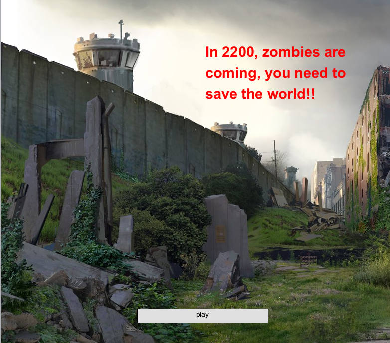
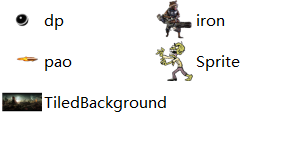
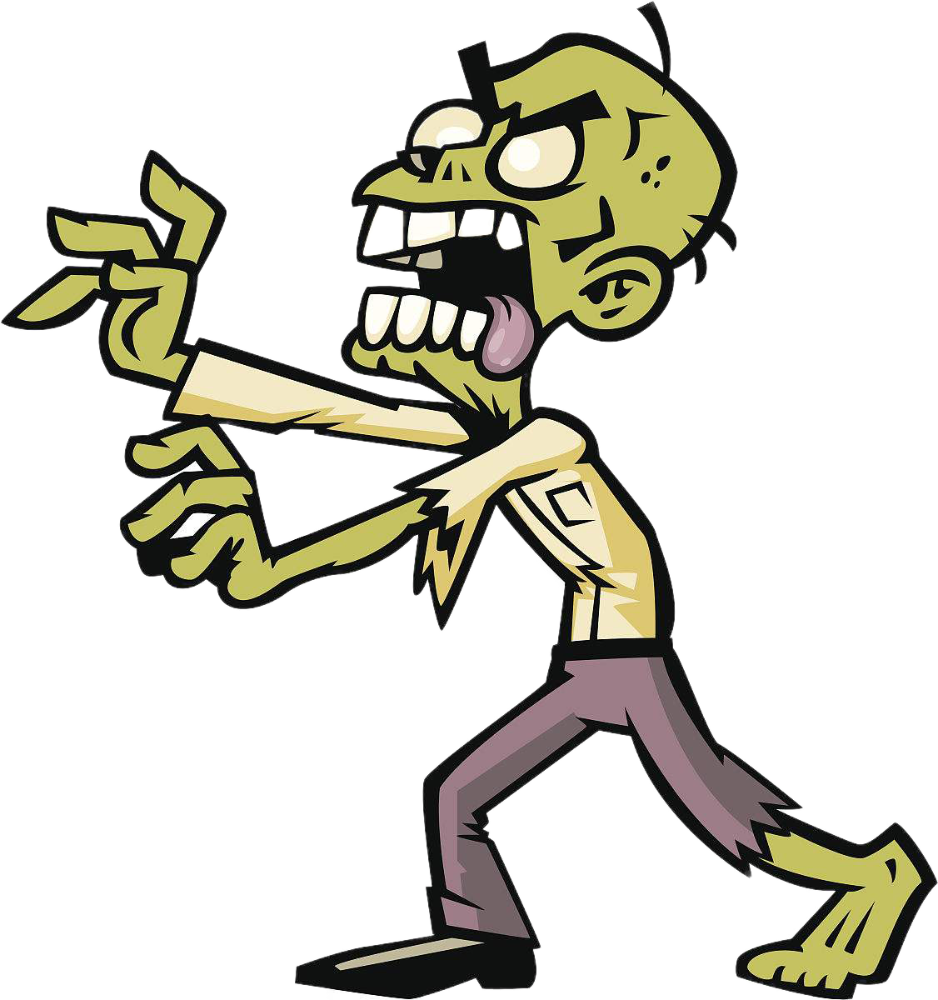
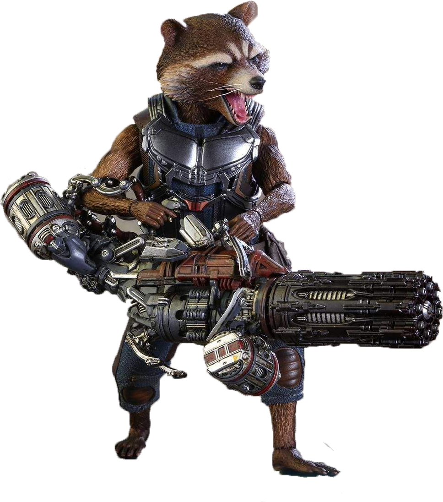
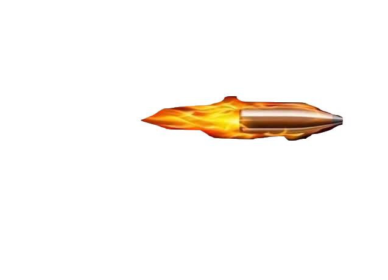
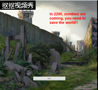

# 游戏进阶

## 游戏策划

1、设想背景

由于要吸引玩家数量，必须设想一个吸引玩家的背景，本游戏的背景为公元2200年，地球遭受陨石袭击，陨石带来了僵尸病毒，病毒将人类同化为僵尸，大肆破坏地球，病毒却将作为浣熊的你进化为火箭浣熊，你需要靠你手上的枪来拯救地球。

## 游戏设计

1、寻找素材

根据背景，寻找了末日的背景图案、火箭浣熊、僵尸、子弹等素材。

2、构想情节

游戏情节是吸引玩家的重要因素

本游戏游戏情节较为简单，即为火箭浣熊打僵尸，在此基础上，设定了僵尸会发射子弹击打火箭浣熊，子弹方向永远跟随火箭浣熊，使游戏更有刺激性。

CRC1

Object:僵尸

Attribute:图片如下图

Collaborator：子弹（僵尸）、子弹（浣熊） 

Events & Actions：
碰撞 & 销毁自己  发射

CRC2

Object:子弹（僵尸）

Attribute:图片如下图

Collaborator：子弹（浣熊）、火箭浣熊

Events & Actions：
碰撞 & 销毁自己  跟踪浣熊

由于开发时发现火箭浣熊发射单发子弹较为单调，于是将火箭浣熊的发射弹道改为三个方向，不断的发射子弹。

CRC3

Object:火箭浣熊

Attribute:图片如下图

Collaborator：子弹（僵尸）、子弹（浣熊） 

Events & Actions：
碰撞 & 销毁自己  发射（120°、240°、360°）

CRC4

Object:子弹（浣熊）

Attribute:图片如下图

Collaborator：子弹（僵尸）、僵尸、浣熊 

Events & Actions：
碰撞 & 销毁自己  碰撞 & 销毁自己 发射

在游戏性方面，设定为玩家使用鼠标移动火箭浣熊，火箭浣熊子弹和僵尸子弹可以对消，使得玩家可以在躲避子弹和击倒僵尸中体会游戏的刺激感。

CRC 5

Object:鼠标

Attribute:图片如下图

Collaborator：火箭浣熊 

Events & Actions：
跟随移动

3、重新开始

若是游戏失败，设置了按压空格键就可重新开始的设定

CRC 6

Object:keyboard

Attribute:图片如下图

Collaborator：

Events & Actions：
返回sheet 1

## 游戏成果

成果由下列GIF展示

