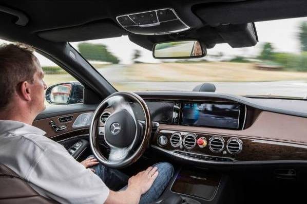
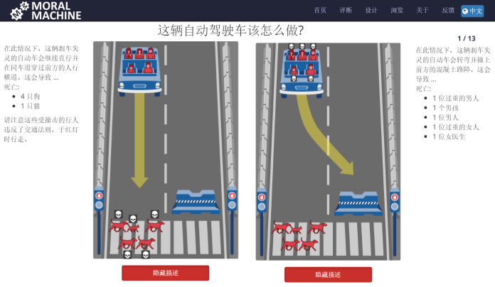

# 自动驾驶引发的伦理问题

## 核心问题

自动驾驶时代已在眼前，但程序设计却遇到难题：当本车面临危险时，例如一辆渣土车翻来，本车若避险只有违章变道，甚至导致冲撞伤人，否则本车可能车毁人亡。若程序设计安排紧急避险，导致第三者伤亡，甚至重大伤亡事故，程序员可能面临司法调查和刑责；若不安排避险，则车可能卖不出去。这类似“扳道工难题”，但这是现实版的，不得不面对。 

这种问题该如何应对？该救谁？

真正的困局在于，人们是否愿意开发能避免绝大多数事故，但又有可能犯下人类不会犯的致命错误的自动驾驶汽车。

（摘自搜狐新闻）

## 理想解决方法

能够采取的对策总的来说有三种：其一，把做伦理决策的工作牢牢握在人类自己手中，在困境发生时由驾驶者直接来做出决策；其二，将人类的伦理编制成算法，由计算机按伦理算法的要求做出决策；其三，计算机像人类那样拥有自己的伦理意识，并据此自主做出决策。 

算法优势在于可以在人类反应极限之外做出反应。“自动驾驶车辆应可避免大部分‘选择困境’——他们的汽车比人反应更迅速、刹车更及时、操纵更灵巧。···算法程序说不定能让汽车躲过一劫”。比如，两车即将相撞，驾驶者去决策的话两车都将不保，而如果交给计算机则有一车可以保存，尽管它要在两车中作出选择。算法可能不总是做出令人满意的选择，但好过任由两车相撞。 

算法无法令人满意的地方在于，它是人们预先设定的，尽管经过充分考虑，总会有遇上没有预先考虑过情况，计算机只是在机械的执行算法，太过没有弹性。因此理想的解决方案可能是，由一名像人那样有思考能力和伦理意识的人工智能去做出判断，这样既能在人类无法在场时做出伦理选择，而且又足够“有人性”。但就目前人工智能的发展而言，尚不能胜任。（洛伯纳人工智能（Loebner AI）竞赛向团队或个人提供了高达10万美元的奖金，只要其创建的计算机能够与人类进行某些形式的对话而不被人识破真实身份。10万美金的Loebner竞赛奖金仍无人认领） 

采用编制伦理算法的对策可能是相对较好而且在技术上可行的选择。制定算法必然要处理电车难题这样的伦理困境，单纯地从义务论还是用效益主义出发，似乎都得不到令人满意的答案。比如我不会赞同，自动驾驶汽车能提高社会总体的交通安全水平，但会是特定的人更危险，尤其当那个特定的人就是我自己。对效益主义和义务论进行调和，以便设计出相对令人满意的算法，但这种调和不总是可行的。考虑下如下算法，在保障每个人基本利益的情况下，追求总体利益最大化，而且总体利益最大化不得使个人的利益减损。这似乎很理想。但电车难题所要展现的恰是面对不能保障每个人基本利益的情况--一些人活下来一些人死去（没有比活下来更根本的利益了）。如果每辆车的算法都在保护乘客的基本利益即生命安全，可能适得其反，两败俱伤，而本来其中一辆车可以安全脱险的。为此，算法需要在这种情况下做出选择，以便有人能够幸存下来。有三种基本方案，1）保存人数最多的那辆车，2）随机选择一辆车保存下来，3）根据乘客预先设定的要求选择一辆车（比如其中一辆车只有一名乘客，他预先设定，如果遇到上述情况他自愿放弃幸存下来的机会）。这三个基本方案可以混合在一起使用，如，在其中一辆车乘客较多的情况下选择较多的那辆保存，在两车乘客数相等的情况下随机选择一辆。如果不想两败俱伤的情况发生，必须制定出一种算法以应对这种状况。 

（摘自豆瓣评论）

## 各国处理方式

美国：
现在只有内华达州、加州和佛罗里达州相继通过了法律条规，允许自动驾驶车辆上路测试。不过，该法规有附加条款，比如车内必须有人持有驾照，懂得操控汽车，在紧急情况下必须接过汽车的控制权。

欧盟：
目前，总部位于布鲁塞尔的欧盟总部也在就如何修改现行有关驾驶的法律法规（ECE R79）从而支持自动驾驶的健康快速发展，展开讨论和研究工作。

日本：
日本也提出要在2020年之前实现自动驾驶汽车方面的立法，并将自动驾驶作为今年9月七国集团交通部长会议的议题，预计会在今年内汇总出法规草案。

（摘自每经网）

## 总结

随着自动驾驶技术的逐步发展，所面临的道德伦理问题已经被提上了日程。如果不能寻求出合理的解决办法，这反而可能成为制约自动驾驶发展的最大难题。MORAL MACHINE网站提出的众包想法着实让人新奇，与单独制定规则不同，这家网站因为能够得到社会反馈而显得十分珍贵。但是，最终想要制定出合理的道德伦理问题解决办法仍需要结合多个方面，而政府未来制定出道德原则将会是一切的基础。 

（摘自车家号）

