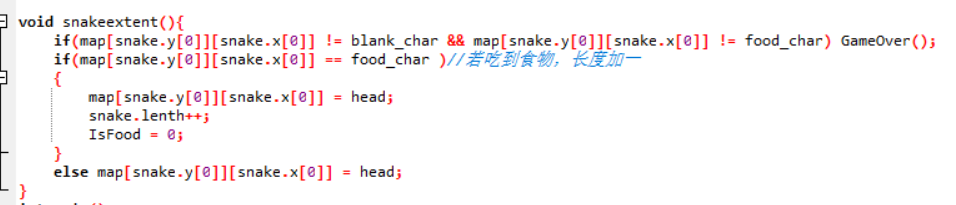

# 贪吃蛇游戏设计及算法

贪吃蛇是一款经典的字符游戏，承载了许多人的童年记忆，我们来看看他如何设计。

## 创造一条会动的蛇

首先我们先来打出我们的地图

我们创建一个结构，表示我们的蛇的长度与位置

初始化蛇的样子与位置

蛇的移动，首先读入字符，判断是哪个方向，然后使尾部变为空格，使头部往前一格，再判断是否触及墙壁，若触及墙壁就游戏结束。

游戏失败

主程序如下

## 设计食物

我们先定义食物的位置

我们要让食物随机出现

当蛇吃到食物时，则食物消失，蛇的尾部增长，长度加一

## 创新玩法

可以扩大地图，创建两条蛇，加入方向键的判断，提供双人模式，让wasd与上下左右的判断同时进行，双人竞技模式。

