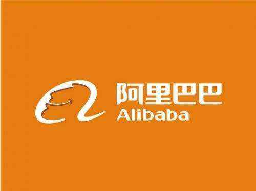

# 中国IT行业风投之我见

## 何为风投

风险投资（英语：Venture Capital，缩写为VC）简称风投，又译称为创业投资，主要是指向初创企业提供资金支持并取得该公司股份的一种融资方式。风险投资是私人股权投资的一种形式。风险投资公司为一专业的投资公司，由一群具有科技及财务相关知识与经验的人所组合而成的，经由直接投资获取投资公司股权的方式，提供资金给需要资金者（被投资公司）。风投公司的资金大多用于投资新创事业或是未上市企业（虽然现今法规上已大幅放宽资金用途），并不以经营被投资公司为目的，仅是提供资金及专业上的知识与经验，以协助被投资公司获取更大的利润为目的，所以是一追求长期利润的高风险高报酬事业。

## 中国IT行业风投现状

现在随着互联网的发展，IT技术越来越受重视，数据显示，2010年全国IT职业培训市场实现销售额53.8亿元，比上一年增长17.4%。IT行业造成大量的网络程序开发、设计、建设、实施以及维护的网络工程师需求空虚，这也吸引了很多风投公司的目光。

## 中国IT行业风投事件

阿里巴巴 

   
在电子商务时代，阿里巴巴以其巨大的市场潜力和美好的发展前景，获得了富达第一笔风投500万美元，到2000年获得来自软银、高盛和富达投资等机构融资共2500万美金。阿里巴巴创造的“网商”时代，成了中国互联网发展的最强音。 
美团 

   
2010年10月，第一轮融资额为2000万美元，来自红杉资本 

    
  2011年7月，第二轮融资额为5000万美元，由阿里巴巴集团领投，北极光、华登国际及红杉等另外三家风投跟投。 

    
  从2011年开始美团就一直传出在做第三轮融资的准备，并在与多家风险投资机构洽谈，但最终没有落定，美团很有可能将在2014年或2015年上市，下面是一些美团网的数据： 

    
  2010年美团的交易额为1.4亿，2011年的交易额是14亿，到2012年的交易额是55亿，到2013年是160亿左右 

    
  美团网2013实现盈利，全年交易额160亿，较2012年增长188%。2013年来自电影票团购的交易额占到中国电影票房的10%左右，酒店团购的交易额也占到整个酒店团购行业的70% 

    
  2013年10月，移动团购类APP活跃用户数，美团团购活跃用户数1644万，投资机构对美团的保守估值为13亿美元

2017年4月17日，陕西强森社区医疗集团股份有限公司获得1亿元融资，由启明创投和君联资本共同领投，股权占比20%。4月11日，杭州网易云音乐科技有限公司获得7.5亿元融资，由上海广播电视台、上海文化广播影视集团有限公司战略领投，芒果文创（上海）股权投资基金合伙企业（有限合伙）、中金佳泰基金参投，此轮融资后，网易云音乐估值为80亿元。4月6日，犀思云（苏州）云计算有限公司获得1.5亿元A轮融资，由晨晖资本领投，达晨创投等机构跟投。 

