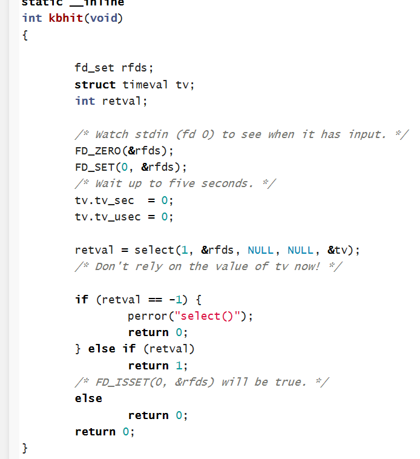
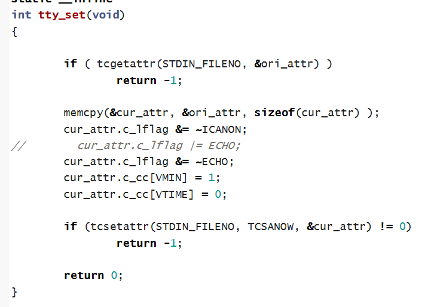
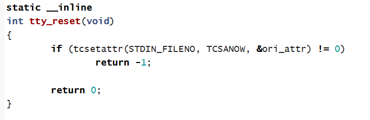

# 智能蛇学习过程

这是一段让我的编程人生受益匪浅的学习。

## 主程序

主程序作用为让你的贪吃蛇代码动起来和判断退出条件，首先先预设好缓冲区，然后放贪吃蛇程序，若键盘输入“q”，则退出游戏，最后恢复终端位置。

## kbhit()

kbhit用于非阻塞地响应键盘输入事件，首先先判断缓冲区是否有输入，然后等待5秒，然后使数值不依赖于tv

## tty_set()

打开功能，该功能为当你输入方向字符时，程序能够读入字符，但不会显示在屏幕上，并且不需要回车作为输入结束条件

## tty_reset()

当需要退出时，重新关闭该功能，输入q时需要回车做结尾。
