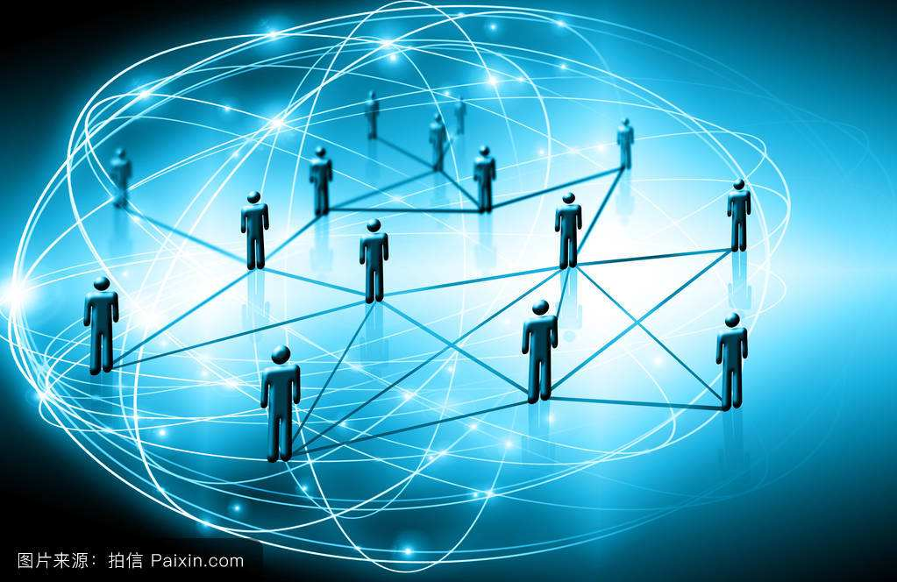
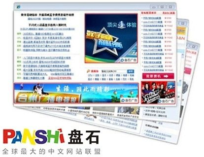
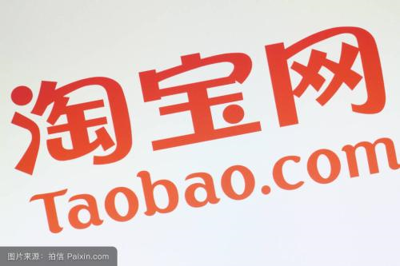
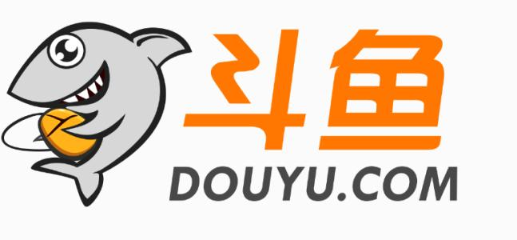
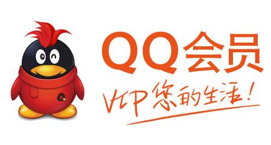
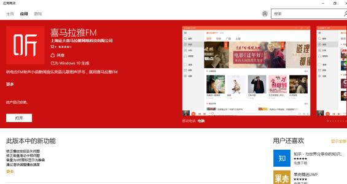
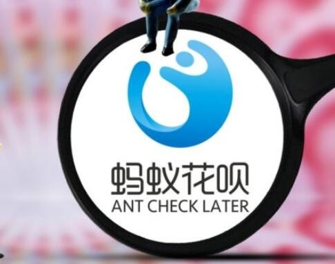

# 互联网时代的盈利模式

现如今，互联网的盈利模式越来越有规律可循，很多公司一开始就设计好产品清晰的盈利模式进入了自觉盈利，他们越来越有钱，财富积累的速度也越来越快。我们来总结一下现在互联网时代的盈利模式。

## 广告

卖广告是早期中国互联网最原始的盈利模式，一直延续到了现在。在门户时代，四大门户网站就开始卖各种广告位，焦点图、通栏、弹窗等，经过20年的进化，广告形式越来越多样化，大数据让目标用户的定向也越来越精准，广告业务也从SSP走向了DSP

## 电商卖商品

世界上最早的电子商务公司是如今的世界首富Jeff Bezos 在1995年创办的亚马逊。中国最早的电子商务公司则是马爸爸在1999年创办的8848

## 平台佣金抽成

平台促成交易后，向商家收取佣金，平台不直接生产创造价值，而是去整合资源。这种方式就像房地产中介里的链家，一头对接房东，另一头对接买房者，当交易达成时抽取2%的费用作为佣金。5月11日刚在美国纽交所敲钟上市的虎牙直播为代表的直播平台最主要的盈利模式便是抽取平台上主播的粉丝打赏或者礼物

## 增值服务

基础功能免费，高级功能收费。先用免费的产品和服务去吸引用户，去抢占市场份额和用户规模，然后再通过增值服务或其他产品收费。今年4月底，雷军在小米的发布会上说小米硬件的净利润率不超过5%，他可能没有撒谎，因为在小米的生态链条里，硬件免费+内容/服务收费，这是一个完整的生态闭环模型

## 收费服务

收费服务早已有之，例如家政服务、家教、导游、律师咨询等，但在互联网时代服务的类型变得更加多元化。想起来前段时间刷屏的陶渊明后人，一个90后在喜马拉雅做主播靠讲故事月入百万，实现财富自由，这在10年前根本是不可能发生的事，但现在发达的SNS网络以及方便的在线支付技术，让这样的事情每天都在发生。

## 金融运作

腾讯与阿里巴巴一直在争夺的付费窗口。

这些都是由流量堆积起来的金融运作模式。