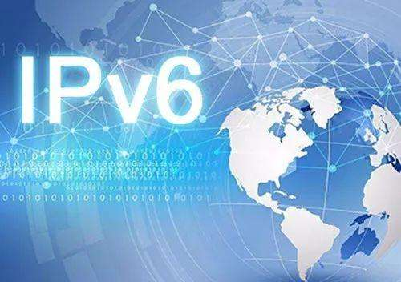
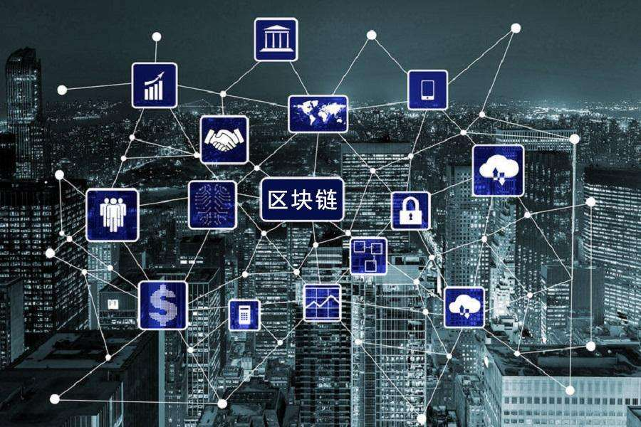

# 互联网时代的热点领域选择、营销方法

## 热点领域

1、ipv6

IPv6是Internet Protocol Version 6的缩写，其中Internet Protocol译为“互联网协议”。IPv6是IETF（互联网工程任务组，Internet Engineering Task Force）设计的用于替代IPv4的下一代IP协议，号称可以为全世界的每一粒沙子编上一个网址

2、人工智能

人工智能（Artificial Intelligence），英文缩写为AI。它是研究、开发用于模拟、延伸和扩展人的智能的理论、方法、技术及应用系统的一门新的技术科学。

3、区块链

区块链是分布式数据存储、点对点传输、共识机制、加密算法等计算机技术的新型应用模式。

4、大数据（big data），指无法在一定时间范围内用常规软件工具进行捕捉、管理和处理的数据集合，是需要新处理模式才能具有更强的决策力、洞察发现力和流程优化能力的海量、高增长率和多样化的信息资产。

## 营销方法

1、饥饿营销

“饥饿营销”，运用于商品或服务的商业推广，是指商品提供者有意调低产量，以期达到调控供求关系、制造供不应求“假象”、以维护产品形象并维持商品较高售价和利润率的营销策略。

2、病毒营销

病毒营销（Viral Marketing，又称病毒式营销、病毒性营销、基因营销或核爆式营销），是利用公众的积极性和人际网络，让营销信息像病毒一样传播和扩散，营销信息被快速复制传向数以万计、数以百万计的观众，它能够像病毒一样深入人脑，快速复制，迅速传播，将信息短时间内传向更多的受众。

3、口碑营销

口碑营销是企业在调查市场需求的情况下，为消费者提供他们所需要的产品和服务，同时制定一定口碑推广计划，让消费者自动传播公司的产品和服务的良好评价，让人们通过口碑了解产品、树立品牌，最终达到企业销售产品和提供服务的目的。

